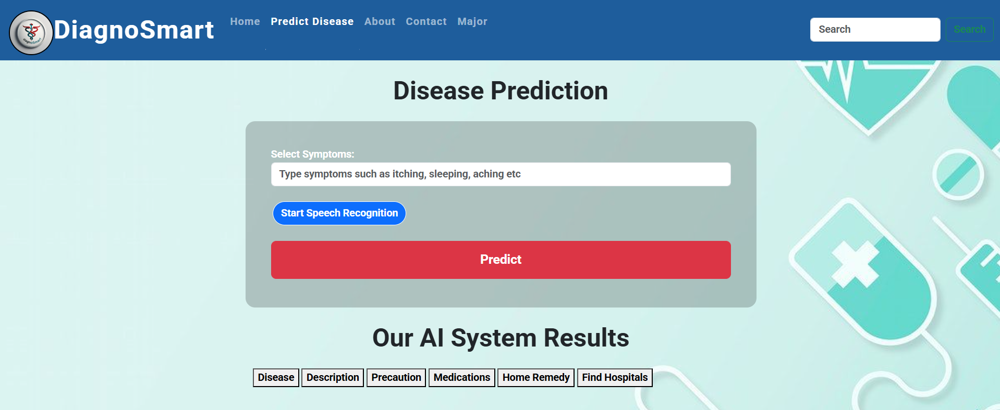

# 🩺 Diagnosmart

**Diagnosmart** is an innovative healthcare application designed to predict diseases based on user symptoms and provide personalized health recommendations. Leveraging advanced machine learning, it helps users stay ahead of health risks with accurate and timely insights.

---

## 🚀 Features

- 📝 **Symptom-based Disease Prediction**  
  Enter symptoms and get predicted diseases instantly.

- 💊 **Personalized Precautions & Remedies**  
  Receive tailored precautions, medications, and home remedies.

- 📊 **Diabetes Prediction Module**  
  Predicts diabetes risk using health metrics.

- ❤️ **Heart Disease Prediction Module**  
  Assesses heart disease risk based on clinical data.

- 🏥 **Nearby Hospital Finder**  
  Helps users locate nearby hospitals based on diagnosis.

- 🖥️ **User-friendly Interface**  
  Accessible via Flask web app and Streamlit interactive app.

---

## 🛠️ Tech Stack

- Python 🐍  
- Flask (Backend web framework)  
- Streamlit (Interactive ML apps)  
- Machine Learning models (SVC and others)  
- HTML/CSS (Frontend UI)  

---

## 🏃 How to Run

---
  
### ▶️ Streamlit App

1. Install dependencies:

    ```bash
    cd DISEASE
    pip install streamlit streamlit-option-menu pandas numpy scikit-learn
    ```

2. Run Streamlit:

    ```bash
    streamlit app.py
    ```

---

### 🔥 Flask App

1. Install dependencies:

    ```bash
    pip install flask pandas numpy pickle-mixin
    ```

2. Run the Flask app:

    ```bash
    python app.py
    ```

3. Open in browser at [http://localhost:5000](http://localhost:5000)

---
---

## 🎬 Project Demo

Click the thumbnail below to watch a short demo of Diagnosmart in action:

<a href="https://www.youtube.com/watch?v=y06p7-kj-yI" target="_blank">
  
</a>

---
## 📝 License

This project is licensed under the MIT License – see the [LICENSE](LICENSE) file for details.


